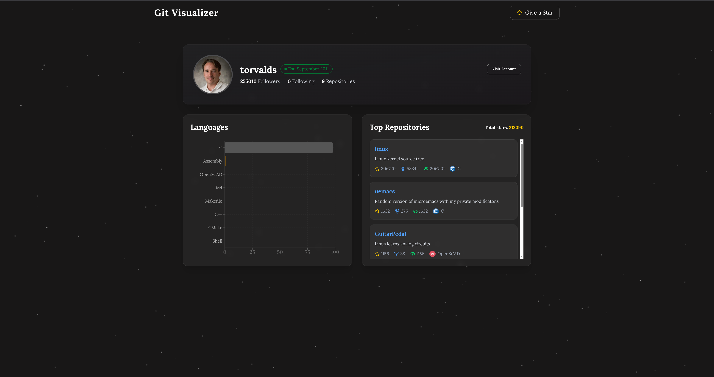

# Git Visualizer

As a developer, mastering GitHub is essential. Git Visualizer lets you explore your GitHub profile visually, displaying your most-used programming languages and most popular repositories. You can also view your followers and following profiles to explore their stats in the same way.

# Preview

# Stack

Git Visualizer is built with React and TypeScript on the client side, and Node.js alongside PostgreSQL on the server side.