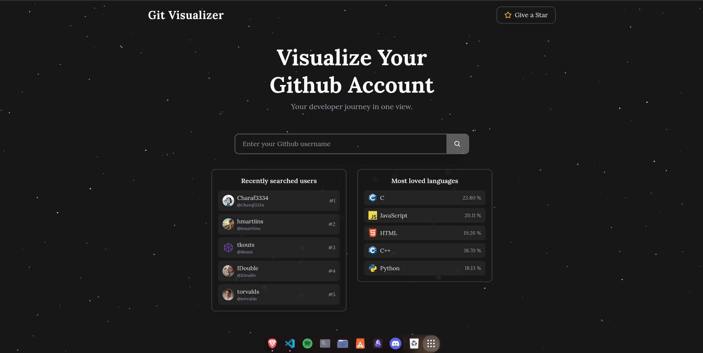
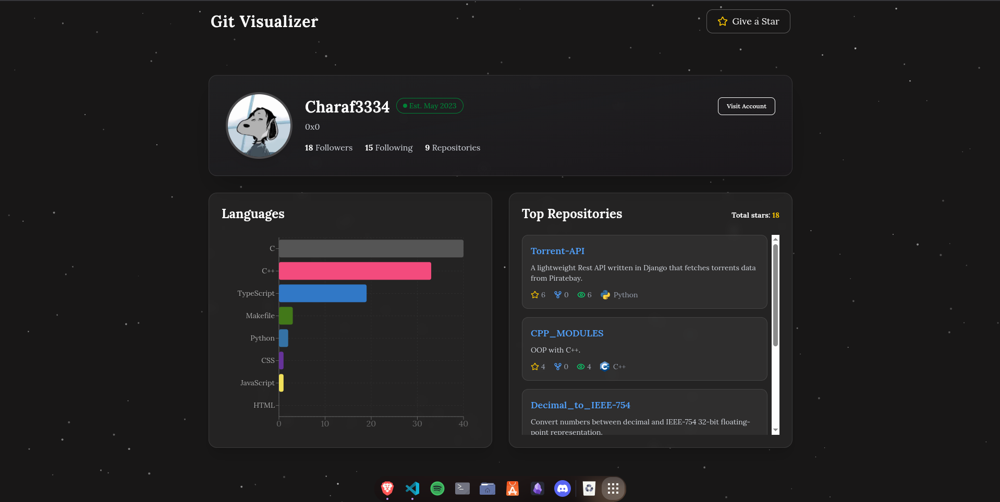
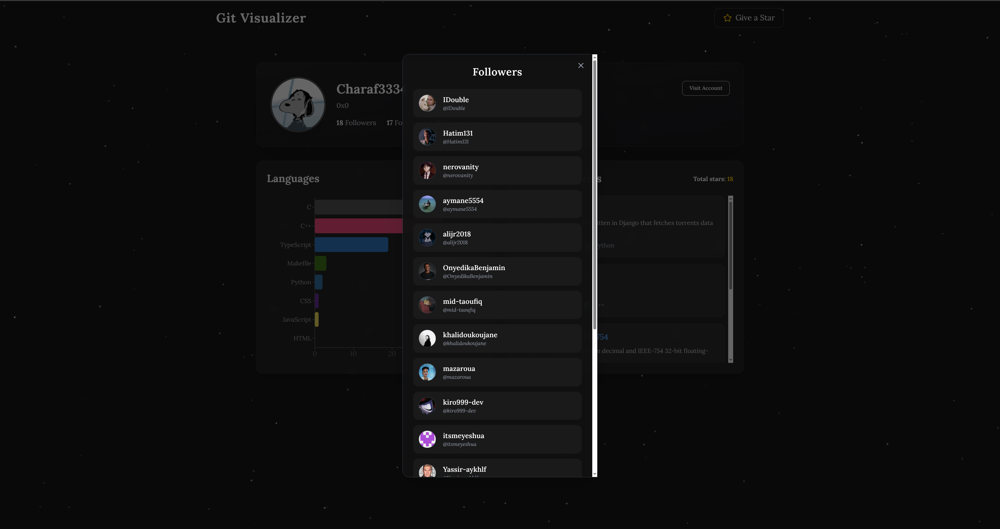

# Browse
[Visit the website](https://git-visualizer.netlify.app/home)

# Git Visualizer

As a developer, mastering Github is essential. Git Visualizer lets you explore your Github profile visually, displaying your most-used programming languages and most popular repositories. You can also view your followers and following profiles to explore their stats in the same way.

# Preview

*Home Page*

*User Page*

*Followers List*

# Stack

Git Visualizer is built with React and TypeScript on the client side, and Node.js alongside PostgreSQL on the server side.
